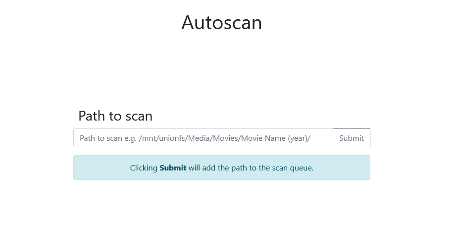
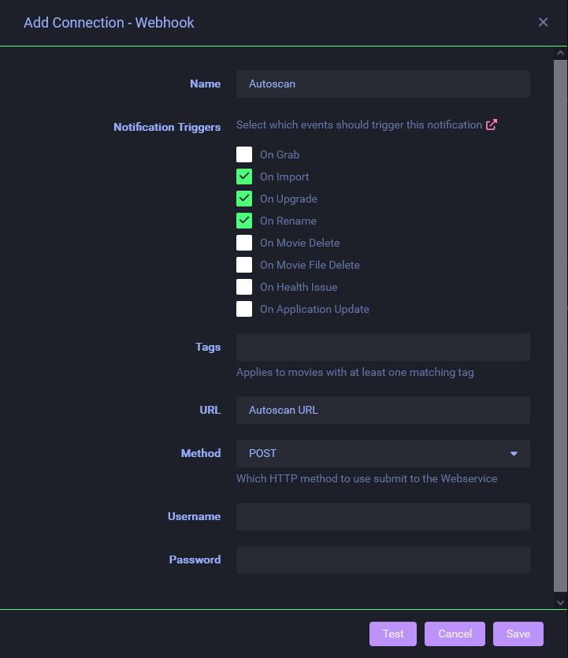

[](https://www.python.org/)
[](https://github.com/NiNiyas/autoscan/blob/master/LICENSE.md)
[](https://github.com/NiNiyas/autoscan/commits/master)
---
Fork of [plex_autoscan](https://github.com/l3uddz/plex_autoscan) by [l3uddz](https://github.com/l3uddz).

- [Introduction](#introduction)
- [Requirements](#requirements)
- [Installation](#installation)
- [Configuration](#configuration)
    - [Example](#example)
    - [Basics](#basics)
    - [Docker](#docker)
    - [Plex Media Server](#plex-media-server)
    - [Jellyfin/Emby](#jellyfinemby)
    - [Autoscan Server](#autoscan-server)
    - [Google Drive Monitoring](#google-drive-monitoring)
    - [rclone remote control](#rclone-remote-control)
- [Setup](#setup)
    - [Sonarr and Radarr](#sonarr-and-radarr)
    - [Lidarr](#lidarr)

# Introduction

Autoscan is a python script that assists in the importing of Sonarr, Radarr, and Lidarr downloads into Plex and/or
Jellyfin/Emby.

It does this by creating a web server to accept webhook requests from these apps, and in turn, sends a scan request to
media servers. Plex will then only scan the parent folder (i.e. season folder for TV shows, movie folder for movies, and
album
folders for music) of the media file (versus scanning the entire library folder). For Jellyfin/Emby, whole library will
be scanned.

In addition to the above, Autoscan can also monitor Google Drive for updates. When a new file is detected, it is
checked against the Plex database and if this file is missing, a new scan request is sent to Plex and/or Jellyfin/Emby (
see section [below](#google-drive-monitoring)).

Autoscan is installed on the same server as the Plex and/or Jellyfin/Emby.

# Requirements

1. Any OS that supports Python 3 or higher.

# Installation

## Ubuntu/Debian

1. `cd /opt`
2. `sudo git clone https://github.com/niniyas/autoscan`
3. `sudo chown -R user:group autoscan` - Run `id` to find your user / group.
4. `cd autoscan`
5. `sudo python -m pip install -r requirements.txt`
6. `python scan.py sections` for Plex or `python scan.py jesections` for Jellyfin/Emby.- Run once to generate a
   default `config.json` file.
7. Edit `/opt/autoscan/config/config.json` - Configure settings (do this before moving on).
8. Edit `/opt/autoscan/system/autoscan.service` - Change two instances of `YOUR_USER` to your user and group (
   do this before moving on).
9. `sudo cp /opt/autoscan/system/autoscan.service /etc/systemd/system/`
10. `sudo systemctl daemon-reload`
11. `sudo systemctl enable autoscan.service`
12. `sudo systemctl start autoscan.service`

## Docker

Pulling `ghcr.io/niniyas/autoscan:latest` should retrieve the correct image for your arch, but you can also pull
specific arch images via tags.

The architectures supported by this image are:

| Architecture |  Tag  |
|:------------:|:-----:|
|    x86-64    | amd64 |
|    arm64     | arm64 |

### Docker Compose

```yaml
version: "3.9"
services:
  autoscan:
    container_name: Autoscan
    image: ghcr.io/niniyas/autoscan:latest
    volumes:
      - /path/to/data:/config
      - /var/run/docker.sock:/var/run/docker.sock # needed if you are running plex in docker.
      - /path/to/plexdb:/plexDb
    ports:
      - "3468:3468/tcp"
    environment:
      - PUID=1000
      - PGID=1000
      - UMASK=002
      - TZ=Europe/Brussels
```

### Docker CLI

```shell
docker run -d \
    --name=Autoscan \
    -e PUID=1000 \
    -e PGID=1000 \
    -e UMASK=002 \
    -e TZ=Europe/Brussels \
    -p 3468:3468/tcp \
    -v /path/to/data:/config \
    -v /path/to/plexdb:/plexDb \
    -v /var/run/docker.sock:/var/run/docker.sock \
    ghcr.io/niniyas/autoscan:latest
```

In most cases you'll need to add additional volumes, to access your files.

## Windows

_Note: It's recommended that you install rclone and Python using chocolatey._

# Configuration

_Note: Changes to config file require a restart of the Autoscan service (
e.g. `sudo systemctl restart autoscan.service` in Ubuntu)._

## Example

You can find example config files for both Windows and Ubuntu/Debian
in [config](config) folder.

## Basics

```json
"USE_SUDO": true,
```

`USE_SUDO` - This option is typically used in conjunction with `PLEX_USER` (e.g. `sudo -u plex`). Default is `true`.

- The user that runs utoscan needs to be able to sudo without a password, otherwise it cannot execute
  the `PLEX_SCANNER` command as `plex`. If the user cannot sudo without password, set this option to `false`.

- If the user that runs Autoscan is able to run the `PLEX_SCANNER` command without sudo or is installed with the
  same user account (e.g. `plex`), you can you can set this to `false`.

## Docker

Docker specific options.

_Note: Some Docker examples used below are based on the image
by [plexinc/pms-docker](https://hub.docker.com/r/plexinc/pms-docker/), with `/config/` in the container path mapped
to `/opt/plex/` on the host. Obvious differences are mentioned between PlexInc and LSIO images._

```json
"USE_DOCKER": true,
"DOCKER_NAME": "plex",
```

`USE_DOCKER` - Set to `true` when Plex is in a Docker container. Default is `false`.

`DOCKER_NAME` - Name of the Plex docker container. Default is `"plex"`.

## Plex Media Server

Plex Media Server options.

### Plex Basics

```json
"ENABLE_PLEX": true,
"PLEX_USER": "plex",
"PLEX_TOKEN": "abcdefghijkl",
"PLEX_LOCAL_URL": "http://localhost:32400",
"PLEX_CHECK_BEFORE_SCAN": false,
"PLEX_WAIT_FOR_EXTERNAL_SCANNERS": true,
"PLEX_ANALYZE_TYPE": "basic",
"PLEX_ANALYZE_DIRECTORY": true,
"PLEX_FIX_MISMATCHED": false,
"PLEX_FIX_MISMATCHED_LANG": "en",
```

`ENABLE_PLEX` - Enable or disable Plex

`PLEX_USER` - User account that Plex runs as. This only gets used when either `USE_SUDO` or `USE_DOCKER` is set
to `true`.

- Native Install: User account (on the host) that Plex runs as.
- Docker Install: User account within the container. Depends on the Docker image being used.
    - [plexinc/pms-docker](https://github.com/plexinc/pms-docker): `"plex"`
    - [linuxserver/plex](https://github.com/linuxserver/docker-plex): `"abc"`
- Default is `"plex"`.

`PLEX_TOKEN` - Plex Access Token. This is used for checking Plex's status, emptying trash, or analyzing media.

- Run the Plex token script by [Werner Beroux](https://github.com/wernight): [plex_token.sh](scripts)

  or

- Read article
  from [Plex Support](https://support.plex.tv/hc/en-us/articles/204059436-Finding-an-authentication-token-X-Plex-Token).

`PLEX_LOCAL_URL` - URL of the Plex Media Server. Can be localhost or http/https address.

- Examples:
    - `"http://localhost:32400"` (native install; docker with port 32400 exposed)
    - `"https://plex.domain.com"` (custom domain with reverse proxy enabled)

`PLEX_CHECK_BEFORE_SCAN` - When set to `false`, autoscan will not check if plex is reachable.
Default is `true`.

`PLEX_WAIT_FOR_EXTERNAL_SCANNERS` - When set to `true`, wait for other Plex Media Scanner processes to finish, before
launching a new one.

- For hosts running a single Plex Docker instance, this can be left as `true`.
- For multiple Plex Docker instances on a host, set this as `false`.

`PLEX_ANALYZE_TYPE` - How Plex will analyze the media files that are scanned. Options are `off`, `basic`, `deep`. `off`
will disable analyzing. Default is `basic`.

`PLEX_ANALYZE_DIRECTORY` - When set to `true`, Plex will analyze all the media files in the parent folder (e.g. movie
folder, season folder) vs just the newly added file. Default is `true`.

`PLEX_FIX_MISMATCHED` - When set to `true`, Autoscan will attempt to fix an incorrectly matched item in Plex.

- Autoscan will compare the TVDBID/TMDBID/IMDBID sent by Sonarr/Radarr with what Plex has matched with, and if this
  match is incorrect, it will autocorrect the match on the item (movie file or TV episode). If the incorrect match is a
  duplicate entry in Plex, it will auto split the original entry before correcting the match on the new item.

- This only works when 1) requests come from Sonarr/Radarr, 2) season folders are being used, and 3) all movies and TV
  shows have their own unique paths.

- Default is `false`.

`PLEX_FIX_MISMATCHED_LANG` - What language to use for TheTVDB agent in Plex.

- Default is `"en"`.

### Plex File Locations

_Note: Verify the settings below by running the Plex Section IDs command (see below)._

```json
"PLEX_LD_LIBRARY_PATH": "/usr/lib/plexmediaserver/lib",
"PLEX_SCANNER": "/usr/lib/plexmediaserver/Plex\\ Media\\ Scanner",
"PLEX_SUPPORT_DIR": "/var/lib/plexmediaserver/Library/Application\\ Support",
"PLEX_DATABASE_PATH": "/var/lib/plexmediaserver/Library/Application Support/Plex Media Server/Plug-in Support/Databases/com.plexapp.plugins.library.db",
```

`PLEX_LD_LIBRARY_PATH`

- Native Install:
    - `"/usr/lib/plexmediaserver/lib"`
- Docker Install: Path within the container. Depends on the image being used.
    - [plexinc/pms-docker](https://github.com/plexinc/pms-docker): `"/usr/lib/plexmediaserver/lib"`
    - [linuxserver/plex](https://github.com/linuxserver/docker-plex): `"/usr/lib/plexmediaserver/lib"`

`PLEX_SCANNER` - Location of Plex Media Scanner binary.

- Native Install:
    - `"/usr/lib/plexmediaserver/Plex\\ Media\\ Scanner"`
- Docker Install: Path within the container. Depends on the image being used.
    - [plexinc/pms-docker](https://github.com/plexinc/pms-docker): `"/usr/lib/plexmediaserver/Plex\\ Media\\ Scanner"`
    - [linuxserver/plex](https://github.com/linuxserver/docker-plex): `"/usr/lib/plexmediaserver/Plex\\ Media\\ Scanner"`

`PLEX_SUPPORT_DIR` - Location of Plex "Application Support" path.

- Native Install:
    - `"/var/lib/plexmediaserver/Library/Application\\ Support"`
- Docker Install: Path within the container. Depends on the image being used.
    - [plexinc/pms-docker](https://github.com/plexinc/pms-docker): `"/var/lib/plexmediaserver/Library/Application\\ Support"`
    - [linuxserver/plex](https://github.com/linuxserver/docker-plex): `"/config/Library/Application\\ Support"`

`PLEX_DATABASE_PATH` - Location of Plex library database.

- Native Install:
    - `"/var/lib/plexmediaserver/Library/Application Support/Plex Media Server/Plug-in Support/Databases/com.plexapp.plugins.library.db"`
- Docker Install: If Autoscan is running directly on the host, this will be the path on the host. If Autoscan
  is running inside a Plex container, this will be a path within the container.

### Plex Section IDs

Running the following command, will return a list of Plex Library Names and their corresponding Section IDs (sorted by
alphabetically Library Name):

```shell
python scan.py sections
```

This will be in the format of:

```
SECTION ID #: LIBRARY NAME
-----------
Path
```

Sample output:

```
Plex Sections:
==============

1) Movies
------------
/media/Movies/
```

### Plex Emptying Trash

When media is upgraded by Sonarr/Radarr/Lidarr, the previous files are then deleted. When Plex gets the scan request
after the upgrade, the new media is added in to the library, but the previous media files would still be listed there
but labeled as "unavailable".

To remedy this, a trash emptying command needs to be sent to Plex to get rid of these missing files from the library.
The options below enable that to happen.

```json
  "PLEX_EMPTY_TRASH": true,
  "PLEX_EMPTY_TRASH_CONTROL_FILES": [
    "/mnt/unionfs/mounted.bin"
  ],
  "PLEX_EMPTY_TRASH_MAX_FILES": 100,
  "PLEX_EMPTY_TRASH_ZERO_DELETED": true
```

`PLEX_EMPTY_TRASH` - When set to `true`, empty trash of a section after a scan.

`PLEX_EMPTY_TRASH_CONTROL_FILES` - Only empty trash when this file exists. Useful when media files, located elsewhere,
is mounted on the Plex Server host. Can be left blank if not needed.

`PLEX_EMPTY_TRASH_MAX_FILES` - The maximum amount of missing files to remove from Plex at one emptying trash request. If
there are more missing files than the number listed, the emptying trash request is aborted. This is particularly useful
when externally mounted media temporarily dismounts and a ton of files go "missing" in Plex. Default is `100`.

`PLEX_EMPTY_TRASH_ZERO_DELETED` - When set to `true`, Autoscan will always empty the trash on the scanned section,
even if there are 0 missing files. If `false`, trash will only be emptied when the database returns more than 0 deleted
items. Default is `false`.

## Jellyfin/Emby

### Basics

```json
"ENABLE_JOE": false
"JELLYFIN_EMBY": "jellyfin",
"JOE_API_KEY": "",
"JOE_HOST": "http://localhost:8096"
```

`ENABLE_JOE` - Enable or Disable Jellyfin/Emby.

`JELLYFIN_EMBY` - Type of server, `jellyfin` or `emby`.

`JOE_API_KEY` - Jellyfin/Emby API key. Make one at `http://<jellyfinoremby_host>/web/index.html#/apikeys.html`.

`JOE_HOST` - Jellyfin/Emby server url with no trailing slash.

### Sections

Running the following command, will return a list of Jellyfin/Emby Library paths:

```shell
scan.py jesections
```

## Autoscan Server

### Basics

```json
"SERVER_IP": "0.0.0.0",
"SERVER_PASS": "9c4b81fe234e4d6eb9011cefe514d915",
"SERVER_PORT": 3468,
"SERVER_SCAN_DELAY": 180,
"SERVER_USE_SQLITE": true
```

`SERVER_IP` - Server IP that Autoscan will listen on. Default is `0.0.0.0`.

- `0.0.0.0` - Allow remote access (e.g. Sonarr/Radarr/Lidarr running on another/remote server).

- `127.0.0.1` - Local access only.

`SERVER_PORT` - Port that Autoscan will listen on.

`SERVER_PASS` - Autoscan password. Used to authenticate requests from Sonarr/Radarr/Lidarr. Default is a random 32
character string generated during config build.

- Your webhook URL will look like: http://ipaddress:3468/server_pass (or http://localhost:3468/server_pass if local
  only).

`SERVER_SCAN_DELAY` - How long (in seconds) Autoscan will wait before sending a scan request to Plex.

- This is useful, for example, when you want Autoscan to wait for more episodes of the same TV show to come in
  before scanning the season folder, resulting in less work for Plex to do by not scanning the same folder multiple
  times. This works especially well with `SERVER_USE_SQLITE` enabled.

`SERVER_USE_SQLITE` - Option to enable a database to store queue requests. Default is `true`.

- The benefits to using this are:

    1. Queue will be restored on Autoscan restart, and

    2. Multiple requests to the same folder can be merged into a single folder scan.

- Example log:

  ```
  Already processing '/data/TV/TV-Anime/Persona 5 the Animation/Season 1/Persona 5 the Animation - s01e01 - I am thou, thou art I.mkv' from same folder, aborting adding an extra scan request to the queue.
  Scan request from Sonarr for '/data/TV/TV-Anime/Persona 5 the Animation/Season 1/Persona 5 the Animation - s01e01 - I am thou, thou art I.mkv', sleeping for 180 seconds...
  ```

  The `180` seconds in the example above are from the `SERVER_SCAN_DELAY`, if any more requests come in during this
  time, the scan request will be delayed by another `180` seconds.

### Server - Path Mappings

List of paths that will be remapped before being scanned by Plex.

This is particularly useful when receiving scan requests, from a remote Sonarr/Radarr/Lidarr installation, that has
different paths for the media.

#### Native Install

Format:

```json
"SERVER_PATH_MAPPINGS": {
    "/path/on/local/plex/host/": [ <--- Plex Library path
        "/path/on/sonarr/host/"  <--- Sonarr root path
    ]
},
```

_Note: This format is used regardless of whether Sonarr is on the same server as Plex or not._

Example:

```json
  "SERVER_PATH_MAPPINGS": {
    "/mnt/unionfs/": [
      "/home/seed/media/fused/"
    ]
  },
```

#### Docker Install

Format:

```json
"SERVER_PATH_MAPPINGS": {
    "/path/in/plex/container/":  [<--- Plex Library path
        "/path/from/sonarr/container/"  <--- Sonarr root path
    ]
},
```

Example:

```json
  "SERVER_PATH_MAPPINGS": {
    "/data/Movies/": [
      "/movies/"
    ]
  },
```

If the filepath that was reported to Autoscan by Radarr was `/home/seed/media/fused/Movies/Die Hard/Die Hard.mkv`
then the path that would be scanned by Plex would be `/mnt/unionfs/Movies/Die Hard/Die Hard.mkv`.

#### Multiple Paths

You can also have more than one folder paths pointing to a single one.

Example:

```json
  "SERVER_PATH_MAPPINGS": {
    "/data/Movies/": [
      "/media/movies/",
      "/local/movies/"
    ]
  },
```

### Server File Checks

After a `SERVER_SCAN_DELAY`, Autoscan will check to see if file exists before sending a scan request to Plex.

```json
"SERVER_MAX_FILE_CHECKS": 10,
"SERVER_FILE_CHECK_DELAY": 60,
"SERVER_SCAN_FOLDER_ON_FILE_EXISTS_EXHAUSTION": false,
```

`SERVER_MAX_FILE_CHECKS` - The number specifies how many times this check will occur, before giving up. If set to `0`,
this check will not occur, and Autoscan will simply send the scan request after the `SERVER_SCAN_DELAY`. Default
is `10`.

`SERVER_FILE_CHECK_DELAY` - Delay in seconds between two file checks. Default is `60`.

`SERVER_SCAN_FOLDER_ON_FILE_EXISTS_EXHAUSTION` - Autoscan will scan the media folder when the file exist checks (as
set above) are exhausted. Default is `false`.

### Server File Exists - Path Mappings

List of paths that will be remapped before file exist checks are done.

This is particularly useful when using Docker, since the folder being scanned by the Plex container, may be different to
the path on the host system running Autoscan.

Format:

```json
  "SERVER_FILE_EXIST_PATH_MAPPINGS": {
    "/actual/path/on/host/": [
      "/path/from/plex/container/"
    ]
  },
```

Example:

```json
  "SERVER_FILE_EXIST_PATH_MAPPINGS": {
    "/mnt/unionfs/media/": [
      "/data/"
    ]
  },
```

You can leave this empty if it is not required:

```json
"SERVER_FILE_EXIST_PATH_MAPPINGS": {
},
```

### Misc

```json
  "RUN_COMMAND_BEFORE_SCAN": "",
  "RUN_COMMAND_AFTER_SCAN": "",
  "SERVER_ALLOW_MANUAL_SCAN": false,
  "SERVER_IGNORE_LIST": [
    "/.grab/",
    ".DS_Store",
    "Thumbs.db"
  ],
  "SERVER_SCAN_PRIORITIES": {
    "1": [
      "/Movies/"
    ],
    "2": [
      "/TV/"
    ]
  },
```

`RUN_COMMAND_BEFORE_SCAN` - If a command is supplied, it is executed before the Plex Media Scanner command.

`RUN_COMMAND_AFTER_SCAN` - If a command is supplied, it is executed after the Plex Media Scanner, Empty Trash and
Analyze commands.

`SERVER_ALLOW_MANUAL_SCAN` - When enabled, allows GET requests to the webhook URL to allow manual scans on a specific
filepath. Default is `false`.

- All path mappings and section ID mappings, of the server, apply.
- This is also a good way of testing your configuration, manually.
- To send a manual scan, you can either:
    - Visit your webhook url in a browser (e.g. http://ipaddress:3468/0c1fa3c9867e48b1bb3aa055cb86), and fill in the
      path to scan.
      

      or
    - Initiate a scan via HTTP (e.g. curl):

      ```
      curl -d "eventType=Manual&filepath=/mnt/unionfs/Media/Movies/Shut In (2016)/Shut In (2016) - Bluray-1080p.x264.DTS-GECKOS.mkv" http://ipaddress:3468/0c1fa3c9867e48b1bb3aa055cb86`
      ```

`SERVER_IGNORE_LIST` - List of paths or filenames to ignore when a requests are sent to Autoscan manually (see
above). Case sensitive.

- For example:
    - `curl -d "eventType=Manual&filepath=/mnt/unionfs/Media/Movies/Thumbs.db" http://ipaddress:3468/0c1fa3c9867e48b1bb3aa055cb86`
      would be ignored if `Thumbs.db` was in the ignore list.

`SERVER_SCAN_PRIORITIES` - What paths are picked first when multiple scan requests are being processed.

- Format:
  ```json
  "SERVER_SCAN_PRIORITIES": {
    "PRIORITY LEVEL#": [
      "/path/to/library/in/Plex"
    ],
  },
  ```

## Google Drive Monitoring

As mentioned earlier, Autoscan can monitor Google Drive for changes. It does this by utilizing a proactive cache (
vs building a cache from start to end).

Once a change is detected, the file will be checked against the Plex database to make sure this is not already there. If
this match comes back negative, a scan request for the parent folder is added into the process queue, and if that parent
folder is already in the process queue, the duplicate request will be ignored.

```json
  "GOOGLE": {
    "ENABLED": false,
    "CLIENT_ID": "",
    "CLIENT_SECRET": "",
    "ALLOWED": {
      "FILE_PATHS": [ ],
      "FILE_EXTENSIONS": true,
      "FILE_EXTENSIONS_LIST": [
        "webm", "mkv", "flv", "vob", "ogv", "ogg",
        "drc", "gif", "gifv", "mng","avi", "mov",
        "qt", "wmv", "yuv","rm", "rmvb", "asf", 
        "amv", "mp4","m4p", "m4v", "mpg", "mp2",
        "mpeg", "mpe", "mpv", "m2v", "m4v", "svi",
        "3gp", "3g2", "mxf", "roq", "nsv", "f4v",
        "f4p", "f4a", "f4b", "mp3", "flac", "ts"
      ],
      "MIME_TYPES": true,
      "MIME_TYPES_LIST": [
        "video"
      ]
    },
    "TEAMDRIVE": false,
    "TEAMDRIVES": [ ],
    "POLL_INTERVAL": 60,
    "SHOW_CACHE_LOGS": false
  },
  "RCLONE": {
    "BINARY": "/usr/bin/rclone",
    "CONFIG": "/home/seed/.config/rclone/rclone.conf",
    "CRYPT_MAPPINGS": {
      "My Drive/encrypt/": [
        "gcrypt:"
      ]
    }
  },
```

`ENABLED` - Enable or Disable Google Drive Monitoring. Requires one time authorization, see below.

`CLIENT_ID` - Google Drive API Client ID.

`CLIENT_SECRET` - Google Drive API Client Secret.

`ALLOWED` - Specify what paths, extensions, and mime types to whitelist.

- `FILE_PATHS` - What paths to monitor.
    - Example ("My Drive" only):
      ```json
      "FILE_PATHS": [
        "My Drive/Media/Movies/",
        "My Drive/Media/TV/"
      ],
      ```
    - Example ("My Drive" with Teamdrives):
      ```json
      "FILE_PATHS": [
        "My Drive/Media/Movies/",
        "My Drive/Media/TV/",
        "Shared_Movies/Movies/",
        "Shared_Movies/4K_Movies/",
        "Shared_TV/TV/"
      ],
      ```    

- `FILE_EXTENSIONS` - To filter files based on their file extensions. Default is `true`.
- `FILE_EXTENSIONS_LIST` - What file extensions to monitor. Requires `FILE_EXTENSIONS` to be enabled.
    - Example:
      ```json
      "FILE_EXTENSIONS_LIST": [
        "webm","mkv","flv","vob","ogv","ogg","drc","gif",
        "gifv","mng","avi","mov","qt","wmv","yuv","rm",
        "rmvb","asf","amv","mp4","m4p","m4v","mpg","mp2",
        "mpeg","mpe","mpv","m2v","m4v","svi","3gp","3g2",
        "mxf","roq","nsv","f4v","f4p","f4a","f4b","mp3",
        "flac","ts"
      ],
      ```

- `MIME_TYPES` - To filter files based on their mime types. Default is `true`.
- `MIME_TYPES_LIST` - What file extensions to monitor. Requires `MIME_TYPES` to be enabled.

    - Example:

      ```json
      "MIME_TYPES_LIST": [
        "video"
      ]
      ```

`TEAMDRIVE` - Enable or Disable monitoring of changes inside Team Drives. Default is `false`.

- _Note: For the `TEAMDRIVE` setting to take effect, you set this to `true` and run the authorize command (see below)._

`TEAMDRIVES` - What Team Drives to monitor. Requires `TEAMDRIVE` to be enabled.

- Format:
  ```json
  "TEAMDRIVES": [
    "NAME_OF_TEAMDRIVE_1",
    "NAME_OF_TEAMDRIVE_2"
  ],
  ```

- Example:
  For 2 Teamdrives named `Shared_Movies` and `Shared_TV`.
  ```json
  "TEAMDRIVES": [
    "Shared_Movies",
    "Shared_TV"
  ],
  ```
- _Note: This is just a list of Teamdrives, not the specific paths within it._

`POLL_INTERVAL` - How often (in seconds) to check for Google Drive changes.

`SHOW_CACHE_LOGS` - Show cache messages from Google Drive. Default is `false`.

`BINARY` - Path to rclone binary if not in standard location.

`CONFIG` - Path to rclone config file containing rclone Crypt remote configuration. Required for rclone Crypt decoder.

`CRYPT_MAPPINGS` - Mapping of path (root or subfolder) of Google Drive crypt (`My Drive/` or `Team Drive Name/`) to
rclone mount name. These values enable rclone crypt decoder.

- Example: Crypt folder on drive called `encrypt` mapped to rclone crypt mount called `gcrypt:`.
  ```json
  "CRYPT_MAPPINGS": {
    "My Drive/encrypt/": [
      "gcrypt:"
    ]
  },
  ```
- Example: Crypt Teamdrive named `Shared_TV` mapped to rclone crypt mount called `Shared_TV_crypt:`.
  ```json
  "CRYPT_MAPPINGS": {
    "Shared_TV/": [
      "Shared_TV_crypt:"
    ]
  },
  ```

---

To set this up:

1. Edit `config.json `file, to enable the Google Drive monitoring and fill in your Google Drive API Client ID and
   Secret.

    ```json
    "ENABLED": true,
    "CLIENT_ID": "yourclientid",
    "CLIENT_SECRET": "yourclientsecret",
    ```

2. Next, you will need to authorize Google Drive.

   ```shell
   python scan.py authorize
   ```

3. Visit the link shown to get the authorization code and paste that in and hit `enter`.

    ```
    Visit https://accounts.google.com/o/oauth2/v2/auth?scope=https%3A%2F%2Fwww.googleapis.com%2Fauth%2Fdrive&redirect_uri=urn%3Aietf%3Awg%3Aoauth%3A2.0%3Aoob&response_type=code&client_id=&access_type=offline and authorize against the account you wish to use
    Enter authorization code:
    ```
4. When access token retrieval is successful, you'll see this:

   ```
   2018-06-24 05:57:58,252 -     INFO -    GDRIVE [140007964366656]: Requesting access token for auth code '4/AAAfPHmX9H_kMkMasfdsdfE4r8ImXI_BddbLF-eoCOPsdfasdfHBBzffKto'
   2018-06-24 05:57:58,509 -     INFO -    GDRIVE [140007964366656]: Retrieved first access token!
   2018-06-24 05:57:58,511 -     INFO -  AUTOSCAN [140007964366656]: Access tokens were successfully retrieved!
   ```

   _Note: Message stating `Segmentation fault` at the end can be ignored._

5. You will now need to add in your Google Drive paths into `SERVER_PATH_MAPPINGS`. This will tell Autoscan to map
   Google Drive paths to their local counterpart.

   i. Native install

    - Format:

      ```json
      "SERVER_PATH_MAPPINGS": {
          "/path/on/local/host": [
              "/path/on/sonarr/host/",
              "path/on/google/drive/"
          ]
      },
      ```

      _Note 1: The Google Drive path does not start with a forward slash (` / `). Paths in My Drive will start with
      just `My Drive/`. and paths in a Google Teamdrive will start with `teamdrive_name/`._

      _Note 2: Foreign users of Google Drive might not see `My Drive` listed on their Google Drive. They can try using
      the `My Drive/...` path or see what the log shows and match it up to that. One example is `Mon\u00A0Drive/` for
      French users._

    - For example, if you store your files under My Drive's Media folder (`My Drive/Media/...`), the server path
      mappings will look like this:

      ```json
      "SERVER_PATH_MAPPINGS": {
        "/mnt/unionfs/Media/Movies/": [
          "/home/seed/media/fused/"
          "My Drive/Media/Movies/"
        ],
      },
      ```

    - For example, if you store your files under a Google Teamdrive called "shared_movies" and within a Media
      folder (`shared_movies/Media/...`), the server path mappings will look like this:

      ```json
      "SERVER_PATH_MAPPINGS": {
        "/mnt/unionfs/Media/Movies/": [
          "/home/seed/media/fused/"
          "shared_movies/Media/Movies/"
        ],
      },
      ```

   ii. Docker install

    - Format:

      ```json
      "SERVER_PATH_MAPPINGS": {
          "/path/in/plex/container/": [
             "/path/from/sonarr/container/",
             "path/on/google/drive/"
          ]
      },
      ```

      _Note 1: The Google Drive path does not start with a forward slash (` / `). Paths in My Drive will start with
      just `My Drive/`. and paths in a Google Teamdrive will start with_ `teamdrive_name/`.

      _Note 2: Foreign users of Google Drive might not see `My Drive` listed on their Google Drive. They can try using
      the `My Drive/...` path or see what the log shows and match it up to that. One example is `Mon\u00A0Drive/` for
      French users._

    - For example, if you store your files under Google Drive's My Drive Media folder (`My Drive/Media/...`) AND run
      Plex in a docker container, the server path mappings will look like this:

      ```json
      "SERVER_PATH_MAPPINGS": {
        "/data/Movies/": [
          "/movies/",
          "My Drive/Media/Movies/"
        ]
      }
      ```

    - For example, if you store your files under Google Drive's Teamdrive called "shared_movies" and within a Media
      folder (`shared_movies/Media/...`) AND run Plex in a docker container, the server path mappings will look like
      this:

        - Format:

          ```json
          "SERVER_PATH_MAPPINGS": {
            "/data/Movies/": [
              "/movies/",
              "NAME_OF_TEAMDRIVE/Media/Movies/"
            ]
          }
          ```

        - Example:

          ```json
          "SERVER_PATH_MAPPINGS": {
            "/data/Movies/": [
              "/movies/",
              "shared_movies/Media/Movies/"
            ]
          }
          ```

6. rclone crypt Support - If your mounted Google Drive is encrypted using rclone crypt, Autoscan can also decode
   the filenames for processing changes. This includes drives/team drives entirely encrypted or just a subfolder.

    1. Configure rclone values. Example below:

        ```json
        "RCLONE": {
          "BINARY": "/usr/bin/rclone",
          "CONFIG": "/home/seed/.config/rclone/rclone.conf",
          "CRYPT_MAPPINGS": {
            "My Drive/encrypt/": [
               "gcrypt:"
            ]
          }
        },
        ```

    2. Disable mime type checking in your config file. This is not currently supported with rclone Crypt Decoding.
       rclone crypt encodes file paths and encrypts files causing Google Drive to reports all files in a crypt as '"
       mimeType": "application/octet-stream"'.

       `"MIME_TYPES": false`

    3. Add in your rclone crypt paths on Google Drive into 'SERVER_PATH_MAPPINGS'. This will tell Autoscan to map
       rclone crypt paths on Google Drive to their local counterpart.

          ```json
          "SERVER_PATH_MAPPINGS": {
            "/home/seed/media/": [
            "My Drive/encrypt/"
            ]
          },
          ```

7. Google Drive Monitoring is now setup.

---

## rclone remote control

_Note: This if for rclone mounts using the "cache" or "vfs" backends._

When `RC_CACHE_REFRESH` is enabled, if a file exist check fails (as set in `SERVER_FILE_EXIST_PATH_MAPPINGS`), Plex
Autoscan will keep sending a rclone cache/expire or vfs/refresh requests, for that file's parent folder, until the file
check succeeds.

For example, if the file `/mnt/unionfs/Media/A Good Movie (2000)/A Good Movie.mkv` doesn't exist locally, then a clear
cache request will be sent to the remote for `A Good Movie (2000)` folder, on the rclone remote. But if a file exist
checks fails again, it will move to the parent folder and try to clear that (eg `Media`), and keep doing this until a
file check exists comes back positive or checks count reaches `SERVER_MAX_FILE_CHECKS`.

```json
  "RCLONE": {
    "RC_CACHE_REFRESH": {
      "ENABLED": false,
      "FILE_EXISTS_TO_REMOTE_MAPPINGS": {
        "Media/": [
          "/mnt/unionfs/Media/"
        ]
      },
      "RC_URL": "http://localhost:5572"
    }
  },
```

`ENABLED` - enable or disable cache clearing.

`FILE_EXISTS_TO_REMOTE_MAPPINGS` - maps local mount path to rclone remote one. Used during file exists checks.

- Format:

  ```json
  "FILE_EXISTS_TO_REMOTE_MAPPINGS": {
    "folder_on_rclone_remote/": [
      "/path/to/locally/mounted/folder/"
    ]
  },
  ```

`RC_URL` - URL and Port rclone RC is set to.

# Setup

Setup instructions to connect Sonarr/Radarr/Lidarr to Autoscan.

## Sonarr and Radarr

1. Sonarr/Radarr -> Settings -> Connect.
2. Add a new Webhook.
3. Add the following:
    - Name: Autoscan
    - On Grab: `No`
    - On Download: `Yes`
    - On Upgrade:  `Yes`
    - On Rename: `Yes`
    - Filter Series Tags: _Leave Blank_
    - URL: _Your Autoscan Webhook URL_
    - Method:`POST`
    - Username: _Leave Blank_
    - Password: _Leave Blank_
4. The settings will look like this:
   
5. Click Save to add Autoscan.

## Lidarr

1. Lidarr -> "Settings" -> "Connect".
2. Add a new "Webhook" Notification.
3. Add the following:
    - Name: Autoscan
    - On Release Import: `Yes`
    - On Upgrade: `Yes`
    - URL: _Your Autoscan Webhook URL_
    - Method:`POST`
4. The settings will look like this:
   
5. Click Save to add Autoscan.

***

